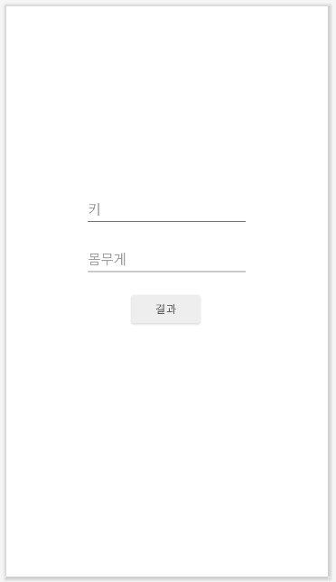
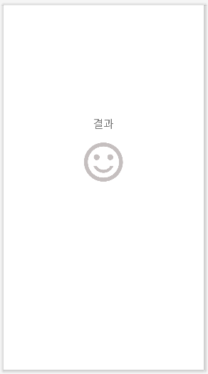

# 비만도 계산하기🏃‍♂️

### **시작하며,**
#### **📝뷰 바인딩이란?**
view binding은 findViewById를 대체할 수 있는 기능이다. 뷰 바인딩을 적용하려면 build.gradle 파일에 일부 텍스트를 추가해주면 된다.

#
### **키와 몸무게를 입력하는 화면 작성**
<div>
    
<div>

#
### **결과 화면 작성**
<div>
    
<div>

#
### **인텐트로 화면 전환**
#### **📝뷰 바인딩 객체 얻기(MainActivity.kt)**
레이아웃 객체를 조작하기 위한  코드 작성

```kotlin
    private val binding by lazy {
        //ActivityMainBinding 클래스는 activity_main 파일의 이름을 참고하여 
        //자동으로 생성된 클래스
        ActivityMainBinding.inflate(layoutInflater)
    }

    override fun onCreate(savedInstanceState: Bundle?) {
        //onCreate 메소드에 추가한 코드에 의해 
        // 바인딩 객체의 근원인 activity_main.xml을 액티비티 화면으로 인식하게 됨
        super.onCreate(savedInstanceState)
        setContentView(binding.root)
    }
```

#### **📝버튼을 누르면 결과 화면으로 전환하는 코드 작성(MainActivity.kt)**
```kotlin
       override fun onCreate(savedInstanceState: Bundle?) {
        super.onCreate(savedInstanceState)
        setContentView(binding.root)

        //resultButton에 onClickListener 설정
        binding.resultButton.setOnClickListener{
            val intent = Intent(this, ResultActivity::class.java)
            startActivity(intent)
        }
    }
```

#### **📝이전 화면으로 돌아가기 위한 업 네비게이션(AndroidManifext.xml)**
```xml
    <activity
        android:name=".ResultActivity"
        android:parentActivityName=".MainActivity"
        android:exported="false" />
```

#### **📝인텐트에 데이터 담기**
weightEditText와 heightEditText가 비지 않았을 경우 intent객체에 weight와 height값을 추가로 넣어줌
```kotlin
    binding.resultButton.setOnClickListener{
        if(binding.weightEditText.text.isNotBlank() 
        && binding.heightEditText.text.isNotBlank()){
            val intent = Intent(this, ResultActivity::class.java).apply{
                putExtra("weight", binding.weightEditText.text.toString().toFloat())
                putExtra("height", binding.heightEditText.text.toString().toFloat())
            }
        }
        //intent 객체는 if문 안에서 생성되었는데...?
        startActivity(intent)
    }
```

#### **📝인텐트로부터 데이터 꺼내기**


#### **📝비만도를 계산하여 분기 처리하기**
#### **📝Toast를 사용하여 간단한 메시지 표시하기**

#
### **SharedPreference로 데이터 저장하기**
