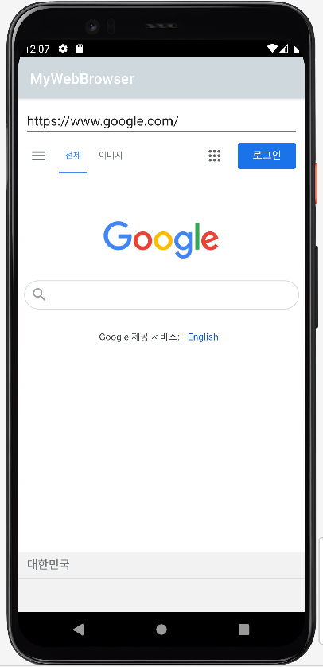

# 나만의 웹 브라우저🙌

### **1. 테마 수정하기**
👇이렇게 바꿔봄👇
```xml
<item name="colorPrimary">@color/blueGray</item>
<item name="colorPrimaryVariant">@color/black</item>
<item name="colorOnPrimary">@color/white</item>
```
<div>
    
<div>

#
### **2. 기본 웹 브라우저 기능 작성**
#### **📝 웹 뷰에 웹 페이지 표시하기(MainActivity.kt)**
```kotlin
binding.webView.apply {
    //javaScriptEnabled 기능 켜기
    settings.javaScriptEnabled = true

    //webViewClient 클래스 지정
    //지정하지 않으면 웹뷰가 아니라 자체 웹 브라우저 동작
    webViewClient = object : WebViewClient() {

        //해당 클래스의 onPageFinished 메소드 재정의
        //페이지의 표시 끝날 때 해당 페이지 URL editText에 표시하도록
        override fun onPageFinished(view: WebView, url: String) {
            binding.urlEditText.setText(url)
        }
    }
}

//웹뷰에 해당 페이지 로딩
binding.webView.loadUrl("https://www.google.com")
```

#### **📝 키보드의 검색 버튼 동작 정의하기(MainActivity.kt)**
```kotlin
//너무 안 익숙한 문법...
binding.urlEditText.setOnEditorActionListener {_, actionId, _ ->
    //actionId값은 검색 버튼에 해당하는 상수와 비교하여 
    //검색 버튼이 눌렸는지 확인
    if(actionId == EditorInfo.IME_ACTION_SEARCH) {
        binding.webView.loadUrl(binding.urlEditText.text.toString())
        true
    } else {
        false
    }
}
```

#### **📝 뒤로가기 동작 재정의(MainActivity.kt)**
```kotlin
override fun onBackPressed(){
    if(binding.webView.canGoBack()){    //웹뷰가 이전 페이지로 갈 수 있다면
        binding.webView.goBack()        //이전 페이지로 이동
    } else {                            //그렇지 않다면
        super.onBackPressed()           //원래 동작(엑티비티종료) 수행
    }
}
```

#
### **3. 옵션 메뉴 사용하기**
#### **📝 옵션 메뉴를 액티비티에 표시하기(MainActivity.kt)**
```kotlin
override fun onCreateOptionsMenu(menu: Menu?): Boolean {
    //menuInflater 객체의 inflate() 메서드 사용하여 메뉴 리소스 지정
    menuInflater.inflate(R.menu.main, menu)
    return true
}
```

#
### **4. 컨텍스트 메뉴 사용하기**

#
### **5. 암시적인 인텐트**
